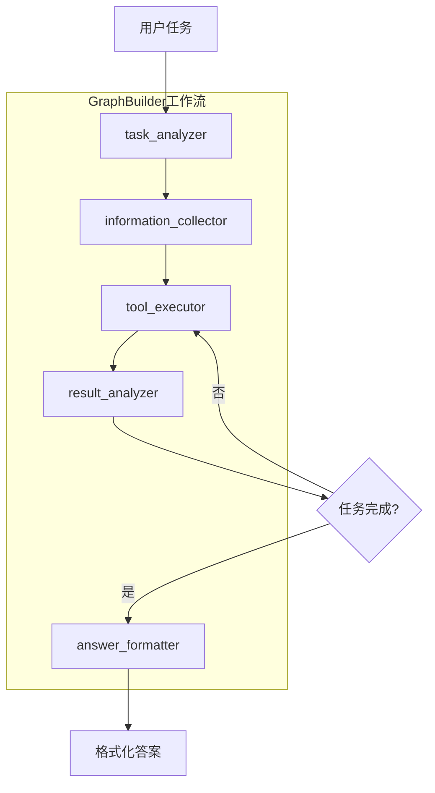

# Strands Multi-Agent Deep Search System

基于Strands Agents SDK和LangGraph的多Agent深度搜索系统，支持复杂任务的智能分解和协作执行。

## 🏗️ 系统架构

### 单Agent模式 (simple_agent.py)
- 传统的单一代理模式
- 适合简单查询和快速响应
- 集成MCP工具和基础功能

### 多Agent模式 (multi_agent.py) 🆕
- 基于Strands GraphBuilder的图形化工作流多Agent架构
- **Task Analyzer Agent**: 任务分析和计划制定
- **Information Collector Agent**: 信息收集和资料整理  
- **Tool Executor Agent**: 工具选择和执行操作
- **Result Analyzer Agent**: 结果分析和完成度判断
- **Answer Formatter Agent**: 答案格式化和输出规范

## 🎯 多Agent系统特色

- ✅ **GraphBuilder架构**: 使用Strands GraphBuilder构建图形化工作流
- ✅ **智能协作**: 5个专门Agent通过图形化工作流协同工作
- ✅ **任务分解**: 自动将复杂任务分解为可执行的子任务
- ✅ **迭代执行**: 支持多轮工具执行，直到任务完成
- ✅ **工作流程**: 完全对应单Agent的工作流程
- ✅ **格式化输出**: 严格按照要求格式化最终答案
- ✅ **图形化执行**: 基于节点和边的工作流执行模式

## 🎯 项目特色

- ✅ **简洁易用**: 专注核心功能，界面清爽
- ✅ **自定义提示词**: 支持任意系统提示词定制
- ✅ **MCP集成**: 支持Model Context Protocol工具
- ✅ **详细模式**: 可查看完整执行过程
- ✅ **多种工具**: 数学计算、文件操作、Python执行、网络请求等

## 🚀 快速开始

### 1. 创建虚拟环境&安装依赖

```bash
python -m venv .venv
source .venv/bin/activate
pip install -r requirements.txt
```

### 2. 配置环境

复制环境配置文件：
```bash
cp .env.example .env
```

编辑 `.env` 文件，填入你的AWS凭证：
```bash
AWS_ACCESS_KEY_ID=your_access_key_here
AWS_SECRET_ACCESS_KEY=your_secret_key_here
AWS_DEFAULT_REGION=us-east-1
```

### 3. 运行系统

**统一启动器 (推荐):**
```bash
python3 run.py
```

**直接运行各模式:**
```bash
# 单Agent模式
python3 simple_agent.py

# 多Agent任务解决
python3 multi_agent.py

# 系统测试
python3 test_multi_agent.py
```


## 💡 选择模式

```bash
选择模式:
1. 交互模式 
2. 单次问答 (推荐)
请选择 (1-2): 
# 测试时推荐直接填 ‘2’ 即可
```

## 🔍 详细模式

### 简洁模式 vs 详细模式

**简洁模式** (默认):
- 只显示最终回答
- 适合日常使用
- 界面清爽

**详细模式**:
- 显示工具调用过程
- 显示Agent思考步骤
- 适合调试和学习

### 启用详细模式

**启动时选择:**
```bash
python simple_agent.py
# 选择 'y' 启用详细模式
```

**运行中切换:**
```
💬 你的问题: verbose
# 输入 'verbose' 切换显示模式
```

### 详细模式示例
```
🤖 思考中...
🔧 Tool Call: current_time()
📤 Tool Result: 2025-01-20 14:30:25 (Sunday)
🔧 Tool Call: calculator(expression="365-20")
📤 Tool Result: 345
💭 Agent思考: 现在我知道了当前时间和计算结果...
✅ 最终回答: 现在是2025年1月20日14:30，星期日。距离年底还有345天。
```

## 🎛️ 交互命令

在交互模式中可以使用以下命令：

- `quit` - 退出程序
- `prompt` - 修改系统提示词
- `verbose` - 切换详细/简洁模式
- `help` - 显示帮助信息

## 🔌 MCP配置

编辑 `mcp_config.json` 来配置MCP服务器：

```json
{
  "mcpServers": {
    "web-search": {
      "command": "npx",
      "args": ["-y", "@smithery/cli@latest", "run", "exa","--key"],
      "disabled": false
    },
    "sqlite": {
      "command": "uvx",
      "args": ["mcp-server-sqlite", "--db-path", "./data.db"],
      "disabled": true
    }
  }
}
```

## 🎯 使用技巧

### 问题设计
- **具体明确**: "用Python分析CSV文件" 比 "分析数据" 更好
- **包含上下文**: 提供必要的背景信息
- **指定格式**: "生成表格"、"画图表"、"写代码"

### 提示词优化
- **明确角色**: 定义专业身份和技能
- **行为指导**: 说明期望的工作方式
- **输出要求**: 指定回答格式和详细程度

### 工具使用
- **组合使用**: 可以要求Agent使用多个工具完成复杂任务
- **文件操作**: 先创建文件，再读取分析
- **图片分析**: 支持分析图片内容、识别文字、描述场景等
- **MCP工具**: 获取实时信息和专业文档

### 图片分析示例
```
问题: "分析这张图片，告诉我图片中有什么内容"
系统提示词: "你是图像分析专家，请详细描述图片内容，包括物体、场景、文字等信息。"

# Agent会自动使用image_reader工具分析图片
```

## 🔍 故障排除

### 常见问题

**Q: MCP工具连接失败？**
```bash
# 检查网络连接
# 验证API密钥
# 确认MCP服务器配置正确
```

**Q: Python代码执行错误？**
```bash
# 检查环境变量设置
export PYTHON_REPL_INTERACTIVE=False
```

**Q: 文件操作权限问题？**
```bash
# 检查目录权限
chmod 755 .
```

### 调试模式

启用详细日志：
```python
# 在simple_agent.py开头修改
logging.basicConfig(level=logging.DEBUG)
```

## 📊 性能优化

### 提升速度
- 精简系统提示词
- 明确具体问题
- 合理选择工具

### 控制成本
- 监控Token使用量
- 避免重复查询
- 优化提示词长度

## 🎉 开始使用

1. **安装依赖**: `pip install strands-agents strands-agents-tools mcp`
2. **配置环境**: 编辑 `.env` 文件
3. **启动程序**: `python simple_agent.py`
4. **选择模式**: 交互模式或单次问答
5. **开始对话**: 输入问题和自定义提示词

## 📄 许可证

本项目采用MIT许可证，详见 [LICENSE](LICENSE) 文件。

## 🤝 贡献

欢迎提交Issue和Pull Request来改进这个项目！

---

**享受与AI代理的智能对话吧！** 🚀

## 🔄 GraphBuilder多Agent工作流程



## 🎯 多Agent使用场景

### 适合多Agent模式的任务:
- **复杂计算**: "计算复合函数的导数并绘制图像"
- **数据分析**: "分析CSV文件中的销售数据并生成报告"
- **信息查询**: "搜索最新的AI技术发展并总结要点"
- **多步骤任务**: "创建一个Python程序，读取文件，处理数据，生成图表"

### 适合单Agent模式的任务:
- **简单问答**: "什么是Docker容器?"
- **代码生成**: "写一个Python排序算法"
- **快速计算**: "计算 2 + 3 * 4"
- **文档解析**: "分析这个图片内容"

## 🔧 配置文件

### multi_agent_config.json
```json
{
  "system_config": {
    "max_iterations": 10,
    "timeout_seconds": 300
  },
  "agent_config": {
    "search": {
      "max_results_per_query": 10,
      "enable_deep_search": true
    },
    "analysis": {
      "analysis_depth": "comprehensive",
      "enable_visualization": true
    }
  }
}
```